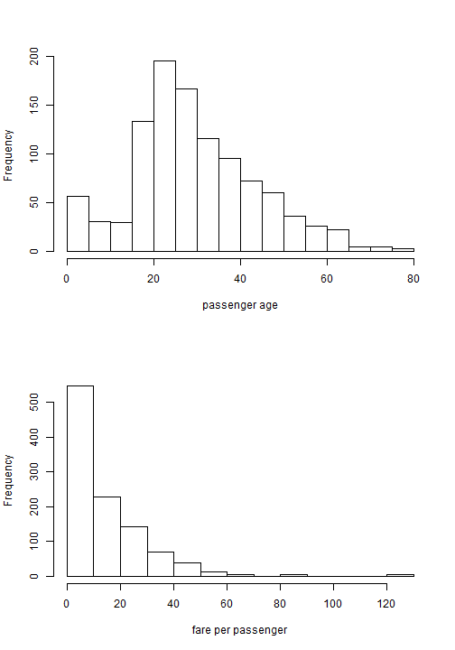
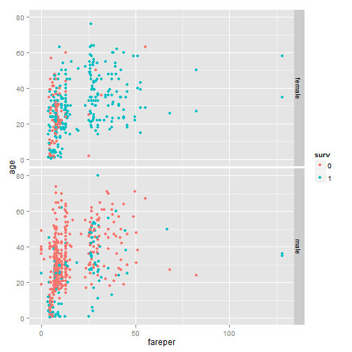

Would YOU Survive the Titanic Disaster?
========================================================
author: S. Pribis
date: December 2014
Developing Data Products course, Data Science specialization, JHU Coursera

What does it do?
========
This app explores the Titanic dataset from the [Vanderbilt University Department of Biostatistics](biostat.mc.vanderbilt.edu/wiki/pub/Main/DataSets/titanic3.xls)

## The app does several things:
1. Predicts the survival of a passenger given their
  + age
  + sex
  + ticket price
2. Converts 2014 US dollars into 1912 British pounds


What does the dataset contain?
========================================================


Eliminating some variables and cleaning up the data, the data set is as follows:

```r
str(titanic3[,-c(2,6:7,10:17)])
```

```
'data.frame':	1045 obs. of  7 variables:
 $ pclass: int  1 1 1 1 1 1 1 1 1 1 ...
 $ name  : Factor w/ 1308 levels "","Abbing, Mr. Anthony",..: 23 25 26 27 28 32 47 48 52 56 ...
 $ sex   : Factor w/ 3 levels "","female","male": 2 3 2 3 2 3 2 3 2 3 ...
 $ age   : num  29 0.917 2 30 25 ...
 $ ticket: chr  "24160" "113781" "113781" "113781" ...
 $ fare  : num  211 152 152 152 152 ...
 $ surv  : Factor w/ 2 levels "0","1": 2 2 1 1 1 2 2 1 2 1 ...
```

What does the data set look like?
======
 

***
        

```r
library(ggplot2)
qplot(fareper, age, color = surv, data = titanic3, facets = sex~.)
```

 


Why build an app about the Titanic?
========================================================

### 1. To show that an app can be built very easily in R/shiny (I did it in only a few days!)
### 2. To make the tragedy of the Titanic more personal

We read and hear about the Titanic, but sometimes we fail to recognize how tragic it really was. By relating oneself to the passengers of the Titanic using the inputs in the app, it allows the user to feel the realness of the tragedy in a different way.

## To visit the app, click **[here!](https://spribis.shinyapps.io/newdeck/)**
